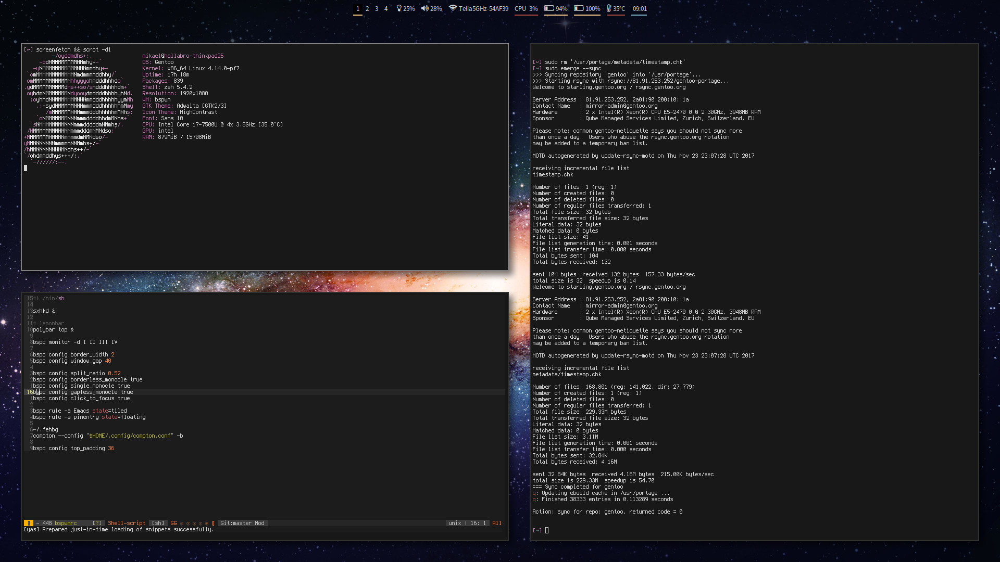

hallabro/dotfiles
=================

Personal configuration of bspwm, emacs, zsh and other stuff.

Installation
============

Install each desired package using `stow`.

* Portage:

    `stow portage -t /etc/portage`

Screenshots
===========

### Dirty

### Clean

